Lenses In Pictures
=======================================

* egonSchiele
 - [blog](http://adit.io/index.html)
 - [twitter](https://twitter.com/_egonschiele)
 - Haskell, Ruby에 관심이 많으며, 그림에도 소질이 있어 보인다.

[original site link](http://adit.io/posts/2013-07-22-lenses-in-pictures.html)


이 글을 읽기 전에 우선 functor가 무엇인지 알아야 됩니다. functor에 대해 배우고 싶으시다면 [이 글](http://adit.io/posts/2013-04-17-functors,_applicatives,_and_monads_in_pictures.html)을 읽으시길 바랍니다.


자, 이제 여러분이 게임을 만든다고 가정해봅시다:


```haskell
data Point = Point { _x, _y   :: Double }
data Mario = Mario { _location :: Point }

player1 = Mario (Point 0 0)
```


그럼, 이제 어떻게 플레이어를 움직일까요?


```haskell
moveX (Mario (Point xpos ypos)) val = Mario (Point (xpos + val) ypos)
```


lenses로 대신, 다음과 같이 작성할 수 있습니다:


```haskell
location.x `over` (+10) $ player1
```


아니면, 다음과 같이 말이죠:


```haskell
over (location . x) (+10) player1
```


Lenses를 이용하여 data의 일 부분을 선택적으로 변경할 수 있습니다:


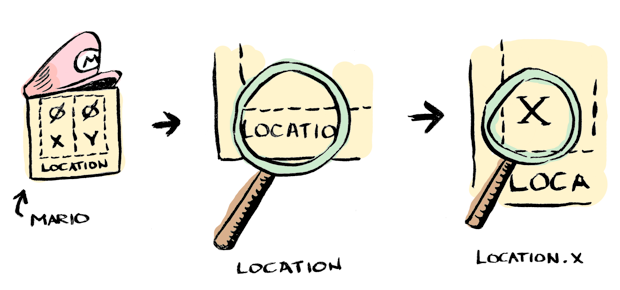


훨씬 깔끔합니다! 전체 예제는 [여기](https://gist.github.com/egonSchiele/5996957)에 있습니다.

`location`은 lens입니다. 그리고 `x`도 lens입니다. 여기선 `player`의 일부분을 수정하기 위해 이러한 lens들을 조합하였습니다.


## Fmap
fmap이 어떻게 동작하는지 자네는 아마 잘 알거야, Doctor Watson. (잘 모르시겠다면 [이 글](http://adit.io/posts/2013-04-17-functors,_applicatives,_and_monads_in_pictures.html)을 읽으시길 바랍니다.)

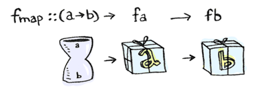


이전 장에서, 과연 functor가 중첩되어 있다면 어떨까요?

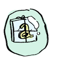


`fmap`을 두번 사용해야만 할껍니다!


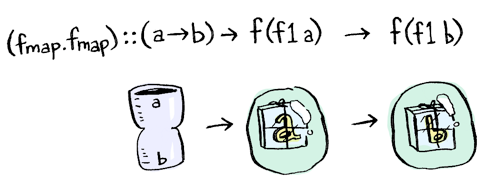


지금, 아마 여러분은 function composition이 어떻게 동작하는지 알고 있을 것입니다:


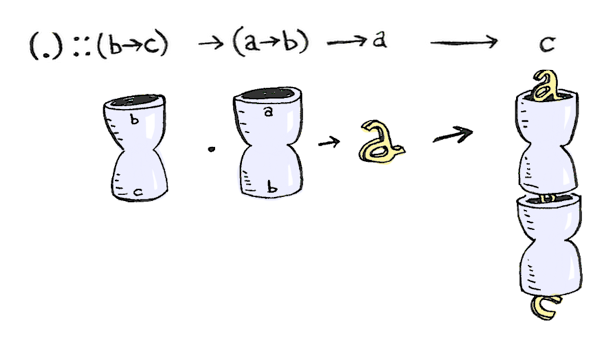


그렇다면, function composition의 composition은 어떨까요?


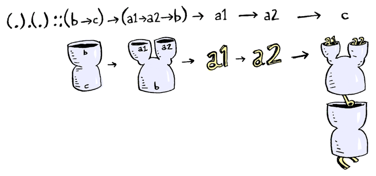


"두개의 인자를 가진 함수에 function composition을 적용하고자 한다면", Sherlock이 말하길, "`(.).(.)`가 필요할걸세!"


"마치 부엉이가 놀란것처럼 보여", Watson은 외쳤습니다.


"정말 그렇군. 그럼 왜 이게 동작하는지 살펴보자고"


function composition의 type signature는:


```haskell
(.) :: (b -> c) -> (a -> b) -> (a -> c)
```


`fmap`과 무척 닮아 있습니다!


```haskell
fmap :: (a -> b) -> f a -> f b
```


사실, `a ->`를 `f`로 바꾸면 그게 바로 fmap입니다!

`a ->`가 functor라면 다음과 같이 정의할 수 있을 것입니다:


```haskell
instance Functor ((->) r) where
   fmap = (.)
```


함수에게 있어, `fmap`은 단지 function composition입니다! `(.).(.)`은 `fmap . fmap`와 동일합니다!


```haskell
(.).(.) :: (b -> c) -> (a1 -> a2 -> b) -> (a1 -> a2 -> c)
fmap . fmap :: (a -> b) -> f (f1 a) -> f (f1 b)
```


 저희는 여기서 패턴을 발견할 수 있습니다: `fmap . fmap`과 `(.) . (.)`은 "한 단계 깊이" 들어갈 수 있도록 해준다.
 `fmap`에서 이는 functor 안으로 들어갈 수 있다는 것을 의미합니다. function composition에서 함수는 `r ->`이며, 이는 함수에 하나의 인자를 더 넘길 수 있다는 것을 의미합니다.


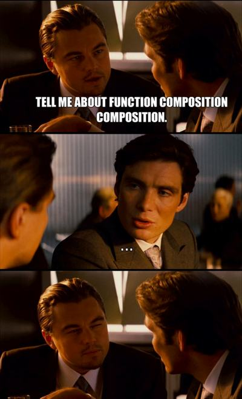


## Setters

다음과 같이 double이란 함수가 있다고 가정해봅시다:

```haskell
double :: Int -> Maybe Int
double x = Just (x * 2)
```

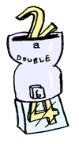


`traverse`로 list에 이 함수를 적용할 수 있습니다.


traverse가 가능한 것과, functor로 감싸진 값을 반환하는 함수를 넘기면, traverse가 가능하지만 functor로 감싸진 것을 돌려받게됩니다.

평소처럼, `traverse`을 조합하여, 한단계 더 나아가 보도록 하겠습니다.


```haskell
traverse :: (a -> m b) -> f a -> m (f b)
traverse.traverse :: (a -> m b) -> f (g a) -> m (f (g b))
```


`fmap`을 `traverse`로 정의할 수 있어, 보다 강력해보입니다:


```haskell
fmapDefault :: Traversable t => (a -> b) -> t a -> t b
fmapDefault f = runIdentity . traverse (Identity . f)
```

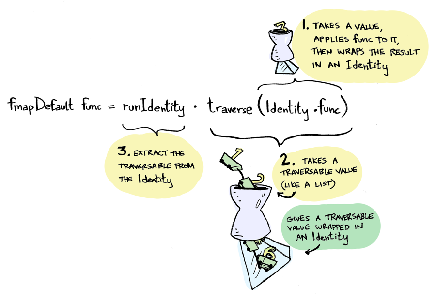


`Identity`는 언제 쓰일까요? [답을 확인해 봅시다.](http://www.reddit.com/r/haskell/comments/1isryj/lenses_in_pictures/cb7r1fy)

`fmapDefault`을 이용하여, `over`라는 함수를 만들어 보도록 하겠습니다. `over`에 `traverse`을 넘기지 않았다는 점을 뺀다면 `fmapDefault`와 같습니다:


```haskell
over :: ((a -> Identity b) -> s -> Identity t) -> (a -> b) -> s -> t
over l f = runIdentity . l (Identity . f)

-- over traverse f == fmapDefault f
```

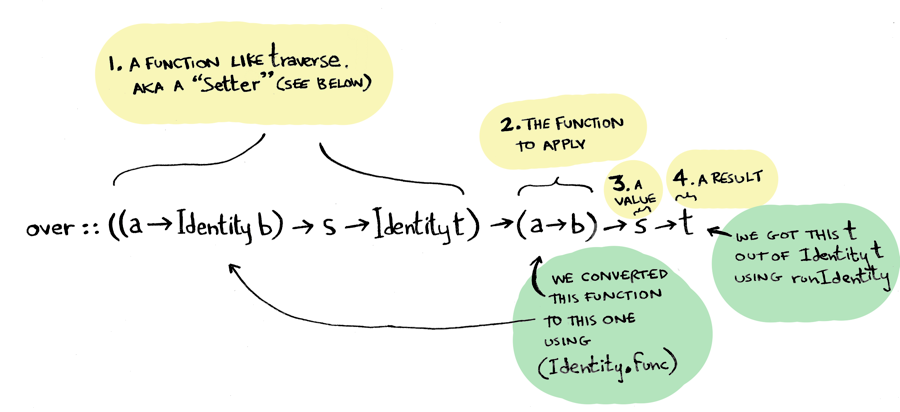


이제 저희는 lenses에 매우 가까이 다가왔습니다! "음 Watson, 나는 lenses를 맛볼(taste) 수 있어. Sherlock이 침을 흘리며 말했습니다. "Lenses는 functor, fold, traversal들을 함께 compose할 수 있게 만들어주지. 지금, 내 입에서 functor와 fold가 합쳐진것을 느낄 수 있어!"

여기서 빨리 type alias를 만들어야겠습니다:


```haskell
type Setter s t a b = (a -> Identity b) -> s -> Identity t
```


이제 저희는 `over`를 더욱 깔끔하게 작성할 수 있게 되었습니다:


```haskell
over :: Setter s t a b -> (a -> b) -> s -> t

-- same as:
over :: ((a -> Identity b) -> s -> Identity t) -> (a -> b) -> s -> t
```


1. `over`는 `Setter`취하고
2. transform 함수와
3. 위 함수에 적용시킬 값도 취한 다음
4. setter를 이용하여, 받은 함수로 받은 값의 일부를 변경한다.


mario를 기억하십니까? 이제 다음 라인이 더 잘 이해가 될겁니다:


```haskell
location.x `over` (+10) $ player1
```

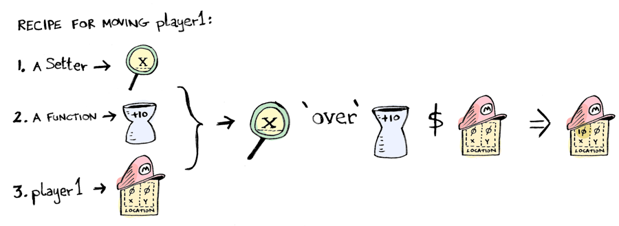


`location . x`는 setter입니다. 그리고, `location`과 `x` 역시 setter입니다! `fmap`나 `(.)`를 composing 한것처럼 한 단계 더" 나아갈 수 있게 만들어주며, setter들을 compose하여 data 내부에 좀 더 깊이 내려갈 수 있습니다! 멋지지 않을 수 없습니다!


## Folds

lenses를 만드는 것에 한단계 더 나아가게 되었습니다.
functor를 compose할 수 있는 setter를 만들었습니다.

사실, fold로도 동일한 일을 할 수 있습니다. 먼저, `foldMapDefault`를 정의해 보겠습니다:

```haskell
foldMapDefault :: (Traversable t, Monoid m) => (a -> m) -> t a -> m
foldMapDefault f = getConst . traverse (Const . f)
```

 [Const가 하는 일은?](http://www.reddit.com/r/haskell/comments/1isryj/lenses_in_pictures/cb7r0lg)

 
위에서 정의한 `fmapDefault`과 모양이 매우 비슷합니다! 결국에는 `Fold`라는 새로운 type alias얻어낼 수 있습니다:


 
```haskell
type Fold s t a b = forall m. Monoid m => (a -> Const m b) -> s -> Const m t
```
 

Setter와 무척 닮았습니다:
 
 
```haskell
type Setter s t a b = (a -> Identity b) -> s -> Identity t
```


[Fold의 전체 어원](https://github.com/ekmett/lens/wiki/Derivation#folds)


`Fold`와 `Setter`의 signature가 무척 닮아있기에, 하나의 type alias로 묶을 수 있습니다.
그리고 저희는 할 수 있습니다!


```haskell
type Lens s t a b = forall f. Functor f => (a -> f b) -> s -> f t
```


## Lenses
 `Setters`는 functor를 위한 것이며 `Folds`는 fold를 위한 것이지만, lenses는 더욱 general한 타입입니다. 이는 functor, function, fold, traversal을 함께 뭉칠 수 있게 만들어 줍니다! 여기 예제 하나가 있습니다:


tuple에 `fmap`을 했을때, 두번째에만 효과가 있는 것이 짜증나지 않으셨습니까?


```haskell
> fmap (+10) (1, 2)
(1,12)

```


둘 다에 적용시키려면 어떻게 할까요? lens를 작성하면 됩니다!


```haskell
> both f (a,b) = (,) <$> f a <*> f b
```


그런 다음, 이를 이용하면:


```haskell
> both `over` (+10) $ (1, 2)
(11,12)
```


lenses를 합쳐 더 깊이 내려 갈 수 도 있습니다! 여기 both 부분과 both부분에 함수를 적용해 보도록 하겠습니다:


```haskell
> (both . both) `over` (+2) $ ((1, 2), (3, 4))
((3,4),(5,6))
```


또한, setter와 fold에 대해서도 합칠 수 있습니다!


## 결론

data가 많이 중첩되어 있다면, lenses는 매우 유용하게 쓰일 수 있습니다.
그리고 이들의 어원 역시, 매우 멋있는 부분입니다! [전체 어원](https://github.com/ekmett/lens/wiki/Derivation)

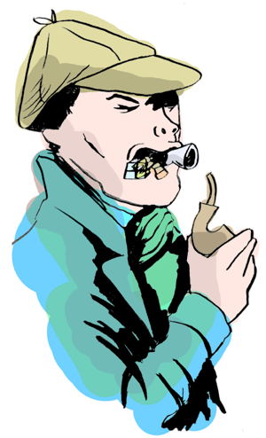

_lenses를 마구 삼키는 Sherlock_

이러한 시각적 접근이 맘에 든다면, [concurrency에 대해 쓴 제 글을 살펴봐 주시기 바랍니다.](http://adit.io/posts/2013-05-15-Locks,-Actors,-And-STM-In-Pictures.html)


## 참고자료

* [github page에 많은 예제들이 있습니다.](https://github.com/ekmett/lens)
* [전체 어원](https://github.com/ekmett/lens/wiki/Derivation)
* [lenses에 대한 또 다른 좋은 글.](https://www.fpcomplete.com/school/pick-of-the-week/basic-lensing)
* [Van Laarhoven 스타일의 lenses.](http://www.twanvl.nl/blog/haskell/cps-functional-references)
